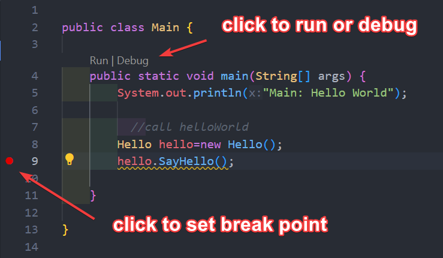

# Lesson 0. Getting Started with Java: Hello World

## 1. Introduce yourself and tell us why you want to learn programming?

Please answer it on [gist Java_01-1](https://gist.github.com/stoneskin/04206703227b3c36a855bfc1f3d3f7ca){:target="_blank"}
if you have no github account, please create one right now.

## 2. Why Java?

- What's programming languages?
- What's different between Java and other languages?

Please do google research, look into at least 3 results. 
And answer the question base your understanding at [gist Java_01-2](https://gist.github.com/stoneskin/635bfbe293450f3901b2852d9887bd9b){:target="_blank"}

## 3. What you will learn from this class

- Java foundation
- Object Oriented Programming
- Data Structure and Algorithm
- Java Projects
- AP CSA practice

## 4. Found out what is the latest version of Java and how to install it

- download java open jdk from <https://jdk.java.net/>{:target="_blank"}
- setup java environment 
    - for windows <https://www.w3schools.com/java/java_getstarted.asp>{:target="_blank"}
    - for Mac [guide to installling Java on MacOs](https://tejaksha-k.medium.com/a-step-by-step-guide-to-installing-java-on-macos-5188bfdf99d7){:target="_blank"}

## 5 Install Java IDE (Integrated Development Environment)

- [Download VSCode](https://code.visualstudio.com/download){:target="_blank"}
  - [Getting Started with Java in VSCode](https://code.visualstudio.com/docs/java/java-tutorial)
- [BlueJ](https://bluej.org){:target="_blank"} Best for OODP part of this class
- [IntelliJ IDEA](https://www.jetbrains.com/idea/{:target="_blank"})
- [Eclipse](https://eclipseide.org/){:target="_blank"}


## 6 HelloWorld Example 

### 6.1 Hello World example in W3school
- Hello World example in W3school ([java get start sample](https://www.w3schools.com/java/java_getstarted.asp){:target="_blank"})


### 6.2 Use BlueJ

  - Create and run `Hello World` program
  - Create a new Project in your IDE
  - Create a new Class with name "HelloWorld"
  - Add method to print string type variable
  - Compile your code
  - Create a instance of your Class "HelloWorld" with " new HelloWorld()"
  - Run the code

### 6.2 Use VSCode
- open the project folder with VSCode
- VS Code set break point for debug
  

### 6.3 Command line Build and run the HelloWorld Sample 1

- Crate a static main method in the HelloWorld Class
 
```java
    //HelloWorld.java
    public class HelloWorld {
        public static void main(String[] args) {
        System.out.println("Hello World");
        }
    }
```

- Run java file
    `java HelloWorld.java`

- Build java file
    `javac HelloWorld.java`
    it will create a HelloWorld.java

- Run builded java class file
    `java HelloWorld`


- use jar simple
       `jar cf HelloWorld.jar HelloWorld.class`  
       `java -cp HelloWorld.jar HelloWorld` // run jar file with out manifest 

- use jar with Manifest file
  Place the MANIFEST.MF file in the META-INF directory within your project structure.
  
    *Most build tools (Maven,Gradle) automatically generate the manifest file with correct information. Configure your build script accordingly.*

  - Create MANIFEST.MF file
  ```java
        //MANIFEST.MF 
        Manifest-Version: 1.0
        Main-Class: HelloWorld
  ```
  - Make sure run Javac to build the java file before run `jar` command below
    `jar cfm HelloWorld.jar MANIFEST.MF *.class`

  - Run Jar file
    `java -jar HelloWorld.jar`
   


### 6.4 HelloWorld Sample 2 (multiple files)

- Source files
Below files in folder `sample2`, also defined as package.

```java
    //Hello.java
    package sample2;
    public class Hello {
        public void SayHello() {
        System.out.println("Hello: Hello World!");
        }
    }
```

```java
    //main
    package sample2;
    import sample2.Hello;
    public class Main {

        public static void main(String[] args) {
            System.out.println("Main: Hello World!");

            //call hello in another java file
            Hello hello=new Hello();
            hello.SayHello();
        
        }

    }
```

```java
    // ./META-INF/MANIFEST.MF
    Manifest-Version: 1.0
    Main-Class: sample2.Main

```

- Run Java file

    `java Main.java`

- Build all java files, go to the parent folder 
    `javac Sample2/*.java`

    `java -cp . sample2.Main`

- build with jar file

    `jar cfm sample2/HelloWorld.jar sample2/META-INF/MANIFEST.MF sample2/*.class`

- run the jar file
    `java -jar sample2/HelloWorld.jar`


## 7 Home Work

- What's the different of BlueJ from others Java IDEs?
  Put you answer as comments of [gist Java_01-7](https://gist.github.com/stoneskin/f5de47688f279eee5c903875c0ea648c)

- Try some AI tool too see how you could learn programming

  - <https://chatgpt.com/>{:target="_blank"}
  - <https://gemini.google.com/app>{:target="_blank"}
  - <https://www.perplexity.ai/>{:target="_blank"} (Best AI tool for learning)
  - <https://arena.lmsys.org/>{:target="_blank"} (compare results any two ai,choice `sus-column-r` for Grok2)

***Code of this page <https://github.com/stoneskin/learnJava/tree/main/00_HelloWorld>***